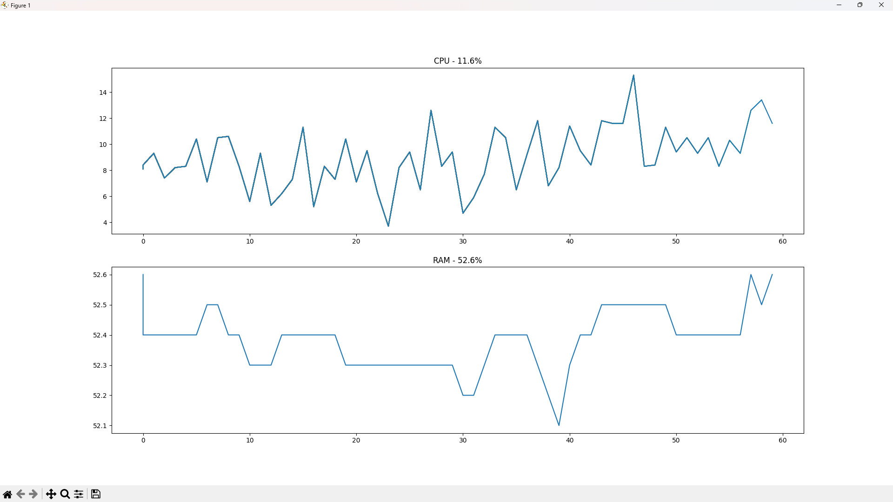

# Usage-Grapher

# English

> ## Used Language
> ### 

> ## Role
> ### This program shows CPU and RAM usage by percentage in matplotlib graph

> ## Usage
> ### 1. Install Module
> ### <pre><code>pip install psutil</code></pre>
> ### <pre><code>pip install matplotlib</code></pre>
> #### **Or**
> ### <pre><code>pip install -r requirements.txt</code></pre>

> ### 2. Run
> ### <pre><code>python usage_graph.py</code></pre>

> ### Preview
> 

# 한국어

> ## 사용 언어
> ### 

> ## 역할
> ### 이 프로그램은 matplotlib 모듈의 그래프로 현재 CPU와 RAM의 사용량을 백분율로 보여줍니다

> ## 사용법
> ### 1. 모듈 설치
> ### <pre><code>pip install psutil</code></pre>
> ### <pre><code>pip install matplotlib</code></pre>
> #### ****또는****
> ### <pre><code>pip install -r requirements.txt</code></pre>

> ### 2. 실행
> ### <pre><code>python usage_graph.py</code></pre>

> ### 미리보기
> 
